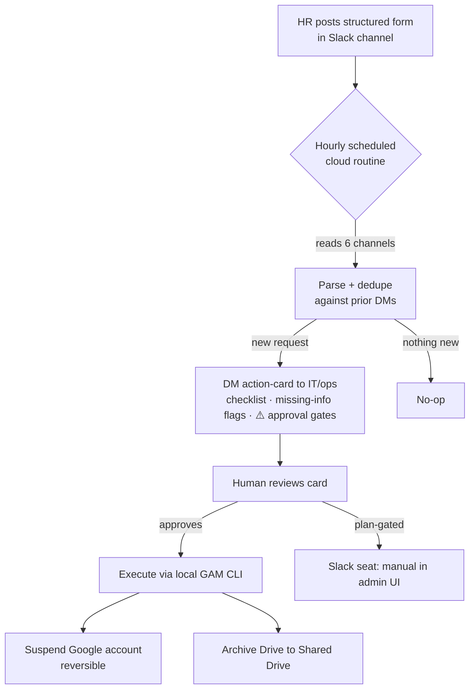

# Offboarding & Onboarding Automation

A self-running employee **on/offboarding triage system** built on a scheduled AI agent runtime with MCP connectors and Google Workspace admin tooling — designed for a multi-org IT/ops environment where HR requests arrive as structured Slack forms.

> **Case study / portfolio repo.** All names, emails, domains, and IDs in this repository are **fabricated examples**. No real credentials, tokens, or employee data are included — see [`SECURITY.md`](SECURITY.md) for what was deliberately excluded and why.

---

## The problem

IT/ops receives a steady stream of **new-hire** and **offboarding** requests across several client organizations. Each arrives as a structured form posted by a Slack workflow bot into a per-org channel:

- New hires → `#newhires-orga`, `#newhires-orgb`, … (form: name, title, start date, manager, personal email, + flags for *Create Google account / Invite to Slack / Send welcome email*)
- Offboarding → `#offboarding` (form: name, termination date, device model, *Remove Google / Remove Slack*, *Google account deletion (requires written approval)*)

Manually watching six channels, parsing each form, chasing missing fields, and remembering which destructive steps need approval is slow and error-prone.

## The solution

A **human-in-the-loop** pipeline that automates the tedious 90% (detection, parsing, triage, drafting) while keeping a human firmly in control of the irreversible 10% (suspensions, deletions).

## Architecture at a glance

| Layer | Tool | Role |
|-------|------|------|
| **Trigger / source** | Slack (MCP connector) | Structured request forms in per-org channels |
| **Triage brain** | AI agent **scheduled cloud routine** | Hourly: read → parse → dedupe → DM action-cards |
| **Execution** | [GAM7](https://github.com/GAM-team/GAM) (Google Workspace Admin) | Suspend/restore accounts, Drive data transfer |
| **Archive** | Google Shared Drive | Cost-effective former-employee Drive backup (vs. 3rd-party) |
| **Memory** | Markdown knowledge base | Durable facts, decisions, capability map across sessions |

## Design decisions that matter

1. **Draft-for-approval by default.** The agent never adds, removes, suspends, or messages autonomously. It produces a ready-to-act card; a human commits. Destructive, outward-facing actions stay gated.
2. **Confirm the exact target before any destructive action.** A real near-miss drove this: two accounts whose usernames differed by a single character (e.g. `j.doe@` vs `j.doer@`) — one was leaving, one was an active employee. The system surfaces look-alikes and requires explicit confirmation of the precise `primaryEmail` before suspending.
3. **Honest capability mapping.** The build distinguishes what's *actually* automatable from what only *looks* automatable:
   - ✅ Google account **suspend/restore** — automatable locally via GAM
   - ✅ Drive **archive/transfer** — automatable via GAM service account (with domain-wide delegation)
   - ⛔ **Slack deactivation** — *not* automatable on a standard Business plan (no SCIM / no `admin.users` API); documented as manual rather than faked
4. **Suspend, don't delete.** Suspension is reversible and is the real access-cut. Account *deletion* stays behind a written-approval gate, always manual.
5. **Cloud vs. local boundary.** The hourly triage runs in the cloud (no machine dependency); privileged execution (GAM) runs locally where the credentials live. The two are deliberately not merged.

## Repository contents

- [`README.md`](README.md) — this overview
- [`SECURITY.md`](SECURITY.md) — what's excluded and the secret-handling model
- [`docs/runbook.md`](docs/runbook.md) — the on/offboarding runbook (fabricated example data)
- [`docs/cloud-agent-prompt.md`](docs/cloud-agent-prompt.md) — the scheduled-agent prompt (IDs redacted)
- [`docs/gam-commands.md`](docs/gam-commands.md) — Google Workspace admin command patterns

## Tech / skills demonstrated

`AI agent runtime` · `MCP connectors (Slack, Google Workspace, Gmail, Calendar)` · `scheduled cloud agents (cron routines)` · `Google Workspace administration (GAM7)` · `service accounts & domain-wide delegation` · `human-in-the-loop agent design` · `secure secret handling` · `multi-tenant ops`

---
